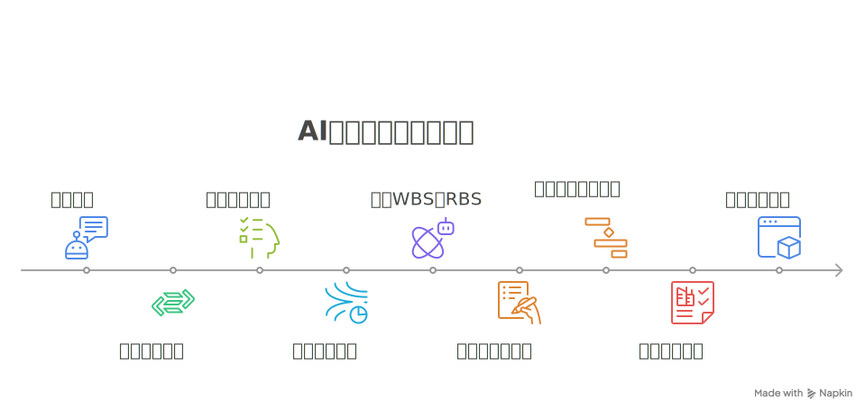
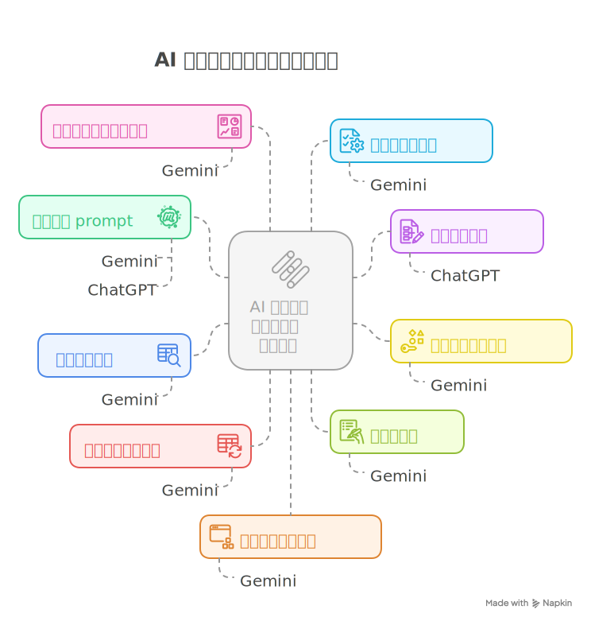

# 電影小幫手 Movie Helper

### 線上網址

<https://rubyf2e.github.io/movie-helper-site/>

<https://rubyrubyruby.my.canva.site/dagqiedp8k8>

## 心得

### 🌱 實作專案的心態調整

在這個專案中，我刻意將自己歸零，重新以「初學者」的心態投入學習與實作。身為資深工程師，我深知這個產業入門容易，深入困難，而 AI 的快速崛起，更進一步降低了入門門檻，卻也重新定義了工程師的角色與價值。

我發現，過去累積的經驗固然重要，但若過度依賴過去的工作習慣和心態去寫程式，反而可能成為與 AI 協作的障礙。與此同時，許多初學者反而能更自然地使用 AI 工具，快速產出具備創意與實用性的成果。

為了不讓經驗變成框架，我選擇用「初學者的方式」去與 AI 協作，並調整心態，讓自己站在和初學者一樣的角度去使用 AI 撰寫這個專案。

<details>
<summary><strong> 🌱 2025.07.10 調整電影待看清單</strong></summary>

##### 完成工時：一天

- **1️⃣ 電影待看清單新增電影搜尋功能**

  - 啟用 Copilot Agent 模式，請 Copilot 在電影待看清單新增電影搜尋功能。
  - Copilot 不但在恰當的地方加上電影搜尋按鈕，還加上很多細節，順便把整個區塊重新設計成暗色調，還幫忙加上背景動畫

- **2️⃣ 調整電影待看清單顏色**

  - 因為比較喜歡原有的淡紫色調，所以請 Copilot 調回來。
  - 在 VS code 點擊 git tree 上該 commit 的程式碼檔案，並與原本的 css 檔和 JS 檔一同給予 Copilot 請它調整
  - 因為舊版的版面為簡單架構淡紫色調，新版的版面為複雜架構暗色調，請 Copilot 調整要詳述，要不然它就會順便改整體架構，又因為相對應的 Scss class 不同，所以需要分階段請 Copilot 處理。

    ##### 指示範例：

    ```
    請幫我把現在(_watchlist.scss) 與 (d8778a00541f5ec1fff95ae3d3d4b68bfe5fa170的_watchlist.scss )共有的css class補回 Watchlist.js，只補相對應css class 標籤，功能不動，功能以現有的為主，樣式以舊有的為主

    此次只改js中的html class樣式，css只補上缺漏的class，html結構保持與現有的複雜架構ㄧ致
    ```

    ```
    watchlist__card 內容色調改成以前 (d8778a00541f5ec1fff95ae3d3d4b68bfe5fa170的_watchlist.scss )的白底色調顏色配置，只改這範圍以內區塊的色調，如有需要，請重新調配顏色，只改顏色
    ```

- **3️⃣ 將電影搜尋功能改成 AI 推薦電影功能**

  - 因為想要把電影搜尋功能改成 AI 推薦電影功能，請 Copilot 逕行修改並整合電影明細燈箱，並在電影待看清單呈現搜尋結果和新增到清單的功能 。
  - Copilot 不但改好了功能，還幫忙加上了提示框，前後端一起調整。

- **4️⃣ 加上官方帳號的加入待看清單的 Line 通知**

  - 手動加上相關程式
  - 詢問 Copilot GitHub Pages 上的 React 無法連接 ngrok 後端 API 的問題之後，依照其建議調整前後端相關程式
  - 調整 GitHub Action 的參數和 deploy-frontend.yml
  - 測試 lint bot 是否正常接受到訊息

- **5️⃣ AI 推薦電影功能抽出來寫成 Service**

  - 啟用 Copilot Agent 模式，請 Copilot 將選取的區塊改寫成 service。
  - Copilot 幫忙寫 AIMovieService，並改寫相關程式
  - 請 Copilot 將 AIMovieService 和 LOCAL_STORAGE_KEY 寫成全域變數方便管理
  - Copilot 生成 /src/utils/constants.js，並改寫相關程式
  - 逐一檢視各檔引入 constants.js 參數和調整架構

- **5️⃣ 加上 Line 登入按鈕**

  - 將 Line Login 的相關 Secrets 寫在 .env 裡
  - 啟用 Copilot Agent 模式，直接請 Copilot 把 LINE Login v2.1 整合到這個專案，Line 登入按鈕放在指定位置，只撰寫前端的部分
  - Copilot 直接寫完前端和 css，前端還寫成 lineAuthService

  </details>

<details>
<summary><strong> 🌱 2025.07.10 將 TMDB API 串接從 React 轉移到 Flask</strong></summary>

##### 完成工時：半天

- **1️⃣ 跟 Copilot 討論 Flask 與 React 專案部署策略**

  - Copilot 建議兩種常見方案：
    - **方案一：前後端分離部署（推薦）**
    - **方案二：單一倉庫統一部署**

- **2️⃣ 前後端分離部署至 github action**

  - 啟用 Copilot Agent 模式，請 Copilot 依「前後端分離部署」方式協助專案整合與部署腳本設計。
  - Copilot 將 React 程式搬家到 frontend，並新增 backend 安裝 Flask，還自己主動幫我寫 TMDB API 串接的程式，並改寫.github/workflows/deploy.yml，主動寫了 DEVELOPMENT.md 和 package.json 方便整合測試部署
  - 請 Copilot 將現有的 Flask API 進行整合，移除 React 相關程式
  - 發現 Copilot 會把 package-lock.json 寫進 .gitignore，如果沒留意，就會在 github action 部署失敗
  - 手動調整 .github/workflows/deploy.yml 轉寫成 .github/workflows/deploy-frontend.yml，github action 只部署 frontend 資料夾
  - 測試 github action 是否部署正常
  </details>

<details>
  <summary><strong> 🌱 2025.07.09 整合 Gemini 生成的網頁元件</strong></summary>

##### 完成工時：一天

- **1️⃣ 使用 Gemini Canvas 生成元件雛形**
  - 用 prompt 請 Gemini 擔任前端工程師，提供工程師專業術語描述的 prompt 要求 Gemini 用 Canvas 生成電影待看清單元件雛形
- **2️⃣ 將雛形網站產生的 JS 和功能與目前的專案整合**
  - 啟用 Copilot Agent 模式，複製 Gemini Canvas 程式碼給 Copilot，請 Copilot 把功能整合在一起
  - Copilot 自己找地方美美的把元件放上去了，連背景都符合網站風格調性的漸層色，還刻成 React 和 Scss 元件，舉一反三的幫我把待看清單放進 Header 裡
- **3️⃣ 置換電影小幫手圖示**

  - 先用 Figma 編輯 Lottielab 套件置入的機器人元件
  - 把不要的圖層刪掉，下載 png 檔，只剩下機器人的頭和軀幹，目標是只留頭
  - 發現各大 AI 無法協助把機器人的軀幹拿掉，手動用圖片編輯器用智慧套索把機器人的軀幹拿掉
  - 把圖片丟回 Figma，生成 svg
  - 置換電影小幫手網站圖示

    
    =>
    
    =>
    

</details>
<details>
  <summary><strong> 🌱 2025.07.09 整合 Gemini 專案企劃書雛形程式</strong></summary>

##### 完成工時：因為是整理學到的東西所以難以估計

- **1️⃣ 使用 Gemini Canvas 生成系統雛形**

  - [**生出各種 prompt**]  
    跟 Gemini 和 ChatGPT 互相討論怎麼寫 prompt 才可以請另一位 AI 模型助理乖乖做事
  - [**專案章程文件**]  
    用 prompt 請 ChatGPT 擔任資深專案經理，生出專案章程
  - [**常見用戶需求清單**]  
    用 prompt 請 Gemini 擔任產品經理助理，列出 20 條最常見的客戶需求（以 user story 形式）
  - [**專案分析報告**]  
    用 prompt 請 Gemini 擔任產品策略顧問，生出專案分析報告
  - [**工作與資源分解表**]  
    用 prompt 請 Gemini 擔任資深專案經理，生出 WBS（工作分解結構）與 RBS（資源分解結構）表單
  - [**專案企劃書**]  
    用 prompt 請 Gemini 擔任資深專案顧問，告訴 Gemini 我是來自台灣的頂尖策略顧問並提供企劃大綱，請他幫我寫專案企劃書
  - [**專案任務規劃與儀表板**]  
    用 prompt 請 Gemini 擔任資深專案顧問，告訴 Gemini 我是初階專案經理，提供專案章程、user story、需求分析報告、WBS（工作分解結構）與 RBS（資源分解結構）給 Gemini，請 Gemini 生成階段性規劃與待辦任務清單，並在 Canvas 介面點擊建立網站產生 [專案儀表板.html](https://rubyf2e.github.io/movie-helper-site/專案儀表板.html)
  - [**專案功能規格書**]  
    用 prompt 請 Gemini 擔任產品經理助理，生出專案規格
  - [**互動系統雛形網站**]  
    用 prompt 請 Gemini 擔任前端工程師，提供階段性規劃與待辦任務清單、專案企劃書和規格給 Gemini 做網頁版互動系統雛形網站

- **2️⃣ 使用 napkin AI 生成 AI 專案管理流程圖**

  - **將前一步驟的資料貼到 napkin AI 生成流程圖**  
    
    

- **3️⃣ 將雛形網站產生的 JS 和功能與目前的專案整合**

  - 啟用 Copilot Agent 模式，複製 Gemini Canvas 程式碼的局部 JS 程式碼區塊，請 Copilot 把功能整合在一起，整合 TMDB API
  - 調整 .env 和 Code review
  - 將功能重複的組件一起給 Copilot，請 Copilot 整合，刪除不需要的組件
  - Copilot 會聯同 Css、Readme、測試一起更新
  - 請 Copilot 移除電影搜尋分類的卷軸，它不但幫我移除還幫我調自適應
  - 檢視頁面並請 Copilot 將部分區塊回復原本的樣式，並手動細調

- **4️⃣ 調整 github action 流程參數**

  - 請 Copilot 修改 .github/workflows/deploy.yml
  - 在 Environments / Configure github-pages 新增 Environment secrets 和 Environment variables
  - 檢視正式站頁面是否有載入參數，並在 /actions/runs 頁面按 Re-run all jobs 重新測試

- **5️⃣ Css 元件化**

  - 請 Copilot 重新整理 style.scss，將硬編碼顏色都整理成 VARIABLES、優化 mixin 使用、優化變數命名、建立主題色彩系統
  - 請 Copilot 將 style.scss 元件化
  - 檢查 UI/功能一致性。
  - 發現有跑版請 Copilot 調整，將 git commit 的 style.scss 舊版本打開，提供給 Copilot，請它調整 scss 模組與舊版本樣式一致
  - 發現 Copilot 調整有它的極限，於是手動 debug。
  - 檢查 UI/功能一致性。

- **6️⃣ 更新 README.md**
  - 請 Copilot 更新 README.md，並檢視校稿

</details>

<details>
<summary><strong> 🌱 2025.07.08 專案導入 ENV、Scss、AI客服介面 完成</strong></summary>

##### 完成工時：一天

- **1️⃣ 新增 ENV 請 Copilot 改寫程式**

  - 新增環境配置的 .env
  - 請 Copilot 依照 .env 的參數去改寫相關檔案
  - 校對檔案是否有符合預期，確保環境變數在所有組件中正確使用
  - 測試重啟開發伺服器後環境變數是否生效
  - 在 GitHub Repository Settings 中設置 Secrets
  - 更新上線

- **2️⃣ 將 CSS 轉換 SCSS**

  - 將 style.css 和 style.scss 丟給 Copilot 請他改寫
  - 將原本的引用改寫
  - 檢查 UI/功能一致性。
  - 發現有跑版請 Copilot 調整，調了六次還改不好，直接把要改的程式貼給它請它改好
  - 檢查 UI/功能一致性。
  - 移除原本的 style.css
  - 更新 git 後重新檢視正式站頁面，確保整體一致性與功能穩定。

- **3️⃣ 調整版面**

  - 微調版面，發現還是直接改比較快
  - 手動加上各 section 背景
  - 請 Copilot 幫忙將選擇區塊加上淡出動畫並請它將動畫調快一點

- **4️⃣ 生成可愛用圖**

  - 登入 https://iconscout.com/ai/illustration-generator
  - 使用 Copilot 幫忙寫 prompt，使用 3D Illustration Generator，AI 生圖

    

  - 在 lottiefiles 找到可愛 AI 客服用圖
    https://app.lottiefiles.com/share/f6aeb9d1-afbc-42c0-83e7-5ba8e4543e35
  - 在 lottiefiles 介面開啟 AI 客服圖下載對話框 png，用 Figma 置換文字，再回 lottiefiles 更新對話框 png，下載 json 和 lottie 檔

      
      =>
      

- **5️⃣ 將 AI 客服圖片置入**
  - 請 Copilot 幫忙把原有的 Lottie 動畫添加為浮動 AI 客服顯示
  - 結果 Copilot 自己加上 emoji Bot 圖當錯誤提示圖加上去還幫我加選單，重新手動調整
  - 請 Copilot 幫忙在 section #explore 的右下置入 AI 生成的 3D 圖片 robot-image
  - 結果 Copilot 自己加上 emoji Bot 圖當錯誤提示圖幫我置入，重新手動調整
  - 請 Copilot 幫忙把圖片壓縮，使用 ImageMagick 壓縮圖片，使用兩倍大圖
  - 請 Copilot 幫我調整 robot-image 的自適應美觀點，因應不同的顯示模式對談校正
  - 調整機器人選單樣式

</details>

<details>
<summary><strong>🌱 2025.07.07 靜態頁轉 React 完成</strong></summary>

##### 完成工時：一天

- **1️⃣ 初始化與轉換開始**

  - 使用 VS Code + GitHub Copilot Chat。
  - 指示 Copilot 將整個靜態頁專案改寫成 React。
  - 執行 `npm init react-app movie-helper-site`，手動整合檔案。
  - 發現 Copilot 有漏檔現象，工程師需主動監工，確保頁面完整。

- **2️⃣ 啟用 Copilot Agent 模式**

  - 將資料夾與檔案給 Copilot，請它幫忙比對轉換前後的效果。
  - Copilot 重新調整程式轉換前後呈現的效果一致。
  - 檢查 UI/功能一致性。

- **3️⃣ 修正手機版漢堡選單**

  - 發現手機版的漢堡有問題，與 Copilot 經過 3 次請求後處理完成。
  - 發現 VScode 問題功能有顯示問題，點選後再問 Copilot，Copilot 協助修正。

- **4️⃣ 修復 VS Code 問題功能顯示錯誤**

  - 發現點選問題功能異常，再次請 Copilot 協助修正。

- **5️⃣ 撰寫測試**

  - 請 Copilot 幫忙補齊測試，產出內容相當完整。
  - 請 Copilot 移除了有多重元素匹配問題的測試用例，確保所有測試通過

- **6️⃣ 補回原本的錨點功能**

  - 原靜態頁有錨點，Copilot 漏掉了。
  - 請 Copilot 協助補齊，Copilot 還自動加入 smooth scroll 動畫效果。

- **7️⃣ 元件化 App.js 區塊**

  - 將在 App.js 過長的 HTML 區塊選取，請 Copilot 轉為 React Component。
  - Copilot 自動建立新檔案與引用，並補上測試。

- **8️⃣ SVG 抽離**

  - 請 Copilot 將散落各檔案的 SVG 抽出成 Icons.js 模組。
  - Copilot 自動更新所有引用與補測試。

- **9️⃣ 優化 index.html 與 meta 標籤**

  - 修改 index.html，請 Copilot 幫忙校稿與補上 SEO 相關 meta 資訊。

- **🔟 最終檢查**

  - 重新檢視所有檔案，確保整體一致性與功能穩定。

- **1️⃣1️⃣ 更新專案結構與文件**

  - 請 Copilot 幫忙產生專案結構
  - Copilot 主動協助修改了 `README.md`，從功能標題以下內容主動更新。
  - 請 Copilot 幫忙改寫本地部署方式
  - 詢問 Copilot 使用其他靜態伺服器這個項目目前是用 react 這樣可以實作嗎
  - Copilot 直接進行測試並在 Vscode 開啟瀏覽器顯示正常

- **1️⃣2️⃣ GitHub Pages 部署**

  - 請 Copilot 協助更新 package.json 和 package-lock.json，新增 gh-pages 依賴
  - 請 Copilot 幫忙生成 .github/workflows/deploy.yml
  - GitHub Pages 設定 Deploy from a branch 改為 GitHub Actions

- **1️⃣3️⃣ 檢查正式站是否正常**
  - 重新檢視正式站頁面，確保整體一致性與功能穩定。

---

**💬 總結**

> 到目前為止，Copilot 是個非常好用的協作同伴，沒有什麼問題，還可以互相學習，而且非常懂得舉一反三，兼顧細節，只是還是需要有工程師幫忙監工。

</details>

<details>
<summary><strong>🌱 2025.06.24 靜態頁完成</strong></summary>

##### 完成工時：兩天

這是第一次用生成式 AI 協作生成的網站，也是將慣用工具從 Sublime Text 轉 VScode 中產生的作品。在協作過程中，發現生成式 AI 比較適合雛形開發，Canva AI 可以幫工程師先行設計畫面和文案，但其網站為壓縮編寫的程式碼不可直接套用，但可透過瀏覽器開發者工具觀看其樣式重新雕刻，ChatGPT 及 VScode GitHub Copilot 可以使用上傳截圖分析產生雛形程式碼和專案規格，完成率可以達到 50%，剩餘的 50%就是需要工程師進行微調修改。

結論：生成式 AI 的出現讓工程師在前端頁面刻板可以有快速的雛形，並且在查詢相關語法時可以節省大量時間，甚至可以透過生成式 AI 的回覆間接學習到最新的程式寫法，越使用生成式 AI，程式能力會跟著提升，但如果要完成可商用的專案，還是非常需要工程師的基礎功和實力。

</details>

## 📦 特點

- **RWD 響應式設計**: 完美適配桌面版、平板、手機等各種裝置
- **AI 電影推薦系統**: 智能分析用戶喜好並推薦相關電影，整合 Azure OpenAI 服務
- **LINE 登入整合**: 完整的 LINE 身份驗證流程、令牌管理與社群功能
- **模組化架構**: SCSS 元件化設計、React 組件化開發、服務導向架構
- **前後端分離**: React 前端 + Flask 後端，支援 TMDB API 與 AI 服務整合
- **環境變數管理**: 安全的 API 密鑰管理與多環境配置
- **完整測試覆蓋**: Jest + React Testing Library 單元測試，包含錯誤處理測試
- **自動化部署**: GitHub Actions 整合與部署，支援前後端分離部署
- **AI 協作開發**: 使用 Google NotebookLM + Canva AI + ChatGPT + Google Gemini + GitHub Copilot 協作生成

## 💡 功能

- **響應式設計**: 支援桌面版、平板、手機等各種裝置
- **AI 電影推薦**: 智能分析使用者電影喜好，提供個人化推薦清單
- **LINE 社群整合**: LINE 登入認證、電影清單分享到 LINE 官方帳號
- **電影待看清單**: 新增、移除、管理個人電影清單，支援本地儲存
- **TMDB API 整合**: 真實電影資料搜尋、類型篩選、詳情查看
- **智能搜尋**: 支援電影名稱關鍵字搜尋，即時結果顯示
- **類型篩選**: 動態載入電影類型，一鍵篩選特定類型電影
- **電影詳情彈窗**: 顯示完整電影資訊（導演、演員、劇情、評分）
- **互動式搜尋**: 搜尋框與標籤篩選功能
- **平滑導航**: 錨點連結與平滑滾動效果
- **組件化架構**: 高度模組化的 React 組件設計
- **完整測試**: Jest + React Testing Library 單元測試
- **PWA 支援**: 漸進式網頁應用配置
- **SEO 優化**: 語意化 HTML 與 meta 標籤優化
- **浮動 AI 客服**: 智能客服介面與互動體驗

## 🛠 技術架構

- **前端框架**：React 19.1.0
- **後端框架**：Flask (Python) - 處理 AI 推薦與 LINE 整合
- **樣式**：SCSS + Responsive Design（模組化架構）
- **API 整合**：TMDB (The Movie Database) API v3、Azure OpenAI API、LINE Bot API
- **身份驗證**：LINE Login OAuth 2.0
- **資料管理**：統一常數管理系統 (constants.js)、localStorage 本地儲存
- **動畫**：Lottie Animation (@lottiefiles/lottie-player)
- **測試**：Jest + React Testing Library
- **部署**：GitHub Pages (前端) + Render/Heroku (後端) + GitHub Actions
- **跨域處理**：Flask-CORS、ngrok 隧道支援
- **環境管理**：多環境變數配置 (.env)

## 🗂 專案結構

```text
movie-helper-site/
├── frontend/                        # React 前端應用
│   ├── public/                      # 靜態資源
│   │   ├── data/
│   │   │   └── content.json        # 電影資料
│   │   ├── images/
│   │   │   ├── MovieIcon.svg       # 應用圖標
│   │   │   ├── AI_bot.lottie       # AI 客服動畫
│   │   │   └── line_qrcode.png     # LINE QR Code
│   │   ├── index.html              # 主 HTML 文件
│   │   ├── manifest.json           # PWA 配置
│   │   └── robots.txt              # SEO 爬蟲配置
│   ├── src/                        # 源碼目錄
│   │   ├── components/             # React 組件
│   │   │   ├── About.js           # 關於我們組件
│   │   │   ├── Explore.js         # 探索數據組件
│   │   │   ├── FloatingAIBot.js   # 浮動 AI 客服組件
│   │   │   ├── Footer.js          # 頁尾組件
│   │   │   ├── GenreFilter.js     # TMDB 類型篩選組件
│   │   │   ├── Header.js          # 頁首與導航組件
│   │   │   ├── Icons.js           # SVG 圖標集合
│   │   │   ├── MovieCard.js       # 電影卡片組件
│   │   │   ├── MovieList.js       # 電影列表組件
│   │   │   ├── MovieModal.js      # TMDB 電影詳情彈窗組件
│   │   │   ├── MovieSearchForm.js # AI 電影搜尋表單組件
│   │   │   ├── MovieTags.js       # 電影標籤組件
│   │   │   ├── SearchBox.js       # 搜尋框組件
│   │   │   ├── TMDBMovieCard.js   # TMDB 電影卡片組件
│   │   │   ├── Watchlist.js       # 電影待看清單組件
│   │   │   └── __tests__/         # 組件測試
│   │   ├── services/              # 服務層
│   │   │   ├── aiMovieService.js  # AI 電影推薦服務
│   │   │   ├── lineAuthService.js # LINE 認證服務
│   │   │   ├── movieAPI.js        # TMDB API 整合服務
│   │   │   └── globalServices.js  # 全域服務管理
│   │   ├── utils/                 # 工具函數
│   │   │   └── constants.js       # 統一常數管理
│   │   ├── scss/                  # 樣式系統（SCSS 模組化）
│   │   │   ├── abstracts/         # 抽象層（變數、混合、動畫）
│   │   │   ├── base/              # 基礎層
│   │   │   ├── components/        # 組件樣式
│   │   │   ├── layout/            # 佈局樣式
│   │   │   ├── pages/             # 頁面樣式
│   │   │   └── style.scss         # 主樣式文件
│   │   ├── App.js                 # 主應用組件
│   │   └── index.js               # 應用入口點
│   └── package.json               # 前端依賴與腳本
├── backend/                        # Flask 後端應用
│   ├── api/                       # API 路由
│   │   ├── movies.py             # 電影相關 API
│   │   └── tmdb_service.py       # TMDB 服務整合
│   ├── tests/                     # 後端測試
│   │   ├── conftest.py           # 測試配置
│   │   └── test_api.py           # API 測試
│   ├── app.py                     # Flask 主應用
│   ├── config.py                  # 配置管理
│   ├── requirements.txt           # Python 依賴
│   └── runtime.txt                # Python 版本配置
├── .github/workflows/             # GitHub Actions
│   └── deploy-frontend.yml        # 前端部署腳本
├── doc/                           # 專案文件
│   └── images/                    # 說明圖片
├── DEVELOPMENT.md                 # 開發說明文件
└── README.md                      # 專案說明文件
```

### 📦 組件架構

```text
App.js (主應用)
├── Header.js (頁首導航)
├── Hero Section (主視覺區塊)
├── Explore.js (數據統計)
├── MovieList.js (電影列表)
│   └── MovieCard.js (電影卡片)
├── Watchlist.js (電影待看清單)
│   └── MovieSearchForm.js (AI 電影搜尋表單)
├── TMDB Movie Search (TMDB 電影搜尋)
│   ├── GenreFilter.js (類型篩選)
│   ├── TMDBMovieCard.js (TMDB 電影卡片)
│   └── MovieModal.js (電影詳情彈窗)
├── SearchBox.js (搜尋功能)
│   └── MovieTags.js (標籤篩選)
├── FloatingAIBot.js (浮動 AI 客服)
├── About.js (關於我們)
└── Footer.js (頁尾)
```

### 🎯 核心功能模組

- **Header.js**: 響應式導航、漢堡選單、平滑滾動錨點
- **Watchlist.js**: 電影待看清單管理、本地儲存、統計資訊、LINE 分享
- **MovieSearchForm.js**: AI 電影推薦搜尋、偏好分析、智能推薦
- **MovieCard.js**: 熱門電影卡片、即將上映卡片、星級評分
- **TMDBMovieCard.js**: TMDB API 電影卡片、評分顯示、詳情觸發
- **GenreFilter.js**: 動態類型篩選、API 驅動的類型選項
- **MovieModal.js**: 電影詳情彈窗、完整資訊展示
- **SearchBox.js**: 搜尋輸入框、類型標籤篩選
- **FloatingAIBot.js**: Lottie 動畫 AI 客服、互動式選單
- **Icons.js**: 統一管理所有 SVG 圖標（CheckIcon, MovieIcon, SearchIcon, StarIcon）
- **Explore.js**: 數據統計展示卡片
- **About.js**: 功能特色列表展示

### 🔧 服務層架構

- **aiMovieService.js**: AI 電影推薦核心服務、偏好分析、推薦算法
- **lineAuthService.js**: LINE OAuth 認證、令牌管理、用戶資料處理
- **movieAPI.js**: TMDB API 整合服務、電影資料獲取
- **globalServices.js**: 全域服務實例管理、避免循環依賴
- **constants.js**: 統一常數管理、API 端點、配置參數

### 🛡️ 後端 API 架構

- **app.py**: Flask 主應用、CORS 配置、路由管理
- **movies.py**: 電影相關 API、AI 推薦端點、LINE 整合
- **tmdb_service.py**: TMDB API 後端整合、資料處理
- **config.py**: 後端配置管理、環境變數處理

### 🧪 測試覆蓋

專案包含完整的單元測試，覆蓋所有 React 組件：

- **組件測試**: 10 個組件測試文件
- **整合測試**: App.js 主應用測試
- **測試工具**: Jest + React Testing Library
- **測試類型**: 渲染測試、交互測試、快照測試

運行測試：

```bash
npm test                # 運行所有測試
npm test -- --coverage # 運行測試並生成覆蓋率報告
npm test -- --watch    # 監聽模式運行測試
```

## 🚀 使用方式

### 開發環境設置

1. **安裝依賴**：

   ```bash
   npm install
   ```

2. **啟動開發伺服器**：

   ```bash
   npm start
   ```

3. **運行測試**：

   ```bash
   npm test
   ```

4. **構建生產版本**：

   ```bash
   npm run build
   ```

### 本地部署方式

#### 方式一：使用 React 開發伺服器（推薦）

```bash
# 克隆專案
git clone https://github.com/rubyf2e/movie-helper-site.git
cd movie-helper-site

# 安裝依賴
npm install

# 啟動開發伺服器
npm start
```

瀏覽器會自動開啟 `http://localhost:3000`

#### 方式二：生產版本部署

```bash
# 構建生產版本
npm run build

# 使用靜態伺服器運行
npx serve -s build
```

或使用其他靜態伺服器：

```bash
# Python HTTP Server
cd build && python3 -m http.server 8000

# Node.js http-server
npm install -g http-server
cd build && http-server -p 8000
```

#### 方式三：VS Code Live Server

1. 在 VS Code 中安裝 "Live Server" 擴展
2. 構建專案：`npm run build`
3. 右鍵點擊 `build/index.html`
4. 選擇 "Open with Live Server"

#### 瀏覽地址

- **開發模式**：`http://localhost:3000`
- **生產模式**：`http://localhost:8000` 或 `http://localhost:5000`（依使用的伺服器而定）

```bash
ngrok http 5000 --host-header="localhost:5000"
# 這樣 ngrok 會：
# 1. 接收外部請求（Host: 99bce85b0333.ngrok-free.app）
# 2. 將 Host header 改寫為 localhost:5000
# 3. 轉發給本地伺服器（Host: localhost:5000）
```

### 手動觸發部署

```bash
git commit --allow-empty -m "Force rebuild to update environment variables"
git push
```
